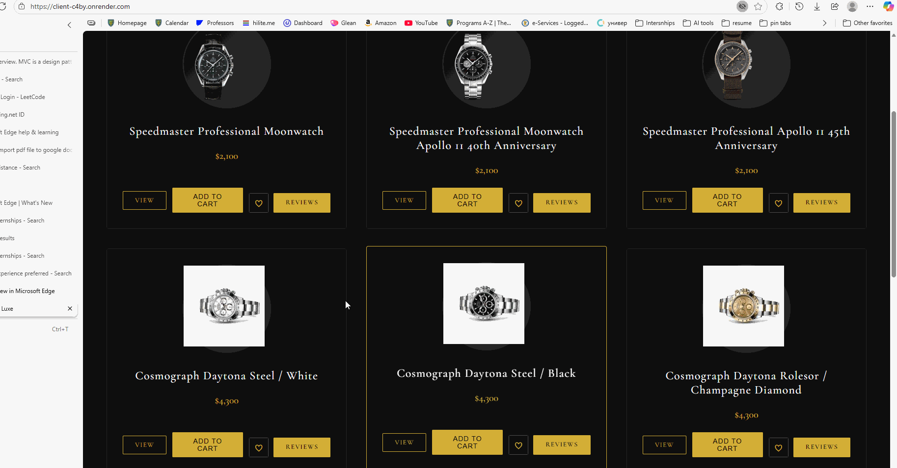

# Milestone 5

This document should be completed and submitted during **Unit 9** of this course. You **must** check off all completed tasks in this document in order to receive credit for your work.

## Checklist

This unit, be sure to complete all tasks listed below. To complete a task, place an `x` between the brackets.

- [X] Deploy your project on Render
  - [X] In `readme.md`, add the link to your deployed project
- [X] Update the status of issues in your project board as you complete them
- [X] In `readme.md`, check off the features you have completed in this unit by adding a ✅ emoji in front of their title
  - [X] Under each feature you have completed, **include a GIF** showing feature functionality
- [X] In this document, complete the **Reflection** section below
- [X] 🚩🚩🚩**Complete the Final Project Feature Checklist section below**, detailing each feature you completed in the project (ONLY include features you implemented, not features you planned)
- [X] 🚩🚩🚩**Record a GIF showing a complete run-through of your app** that displays all the components included in the **Final Project Feature Checklist** below
  - [X] Include this GIF in the **Final Demo GIF** section below

## Final Project Feature Checklist

Complete the checklist below detailing each baseline, custom, and stretch feature you completed in your project. This checklist will help graders look for each feature in the GIF you submit.

### Baseline Features

👉🏾👉🏾👉🏾 Check off each completed feature below.

- [X] The project includes an Express backend app and a React frontend app
- [X] The project includes these backend-specific features:
  - [X] At least one of each of the following database relationships in Postgres
    - [X] one-to-many
    - [X] many-to-many with a join table
  - [X] A well-designed RESTful API that:
    - [ ] supports all four main request types for a single entity (ex. tasks in a to-do list app): GET, POST, PATCH, and DELETE
      - [X] the user can **view** items, such as tasks
      - [X] the user can **create** a new item, such as a task
      - [ ] the user can **update** an existing item by changing some or all of its values, such as changing the title of task
      - [X] the user can **delete** an existing item, such as a task
    - [X] Routes follow proper naming conventions
  - [X] The web app includes the ability to reset the database to its default state
- [X] The project includes these frontend-specific features:
  - [X] At least one redirection, where users are able to navigate to a new page with a new URL within the app
  - [X] At least one interaction that the user can initiate and complete on the same page without navigating to a new page
  - [X] Dynamic frontend routes created with React Router
  - [X] Hierarchically designed React components
    - [X] Components broken down into categories, including Page and Component types
    - [X] Corresponding container components and presenter components as appropriate
- [X] The project includes dynamic routes for both frontend and backend apps
- [X] The project is deployed on Render with all pages and features that are visible to the user are working as intended

### Custom Features

👉🏾👉🏾👉🏾 Check off each completed feature below.

- [X] The project gracefully handles errors
- [X] The project includes a one-to-one database relationship
- [X] The project includes a slide-out pane or modal as appropriate for your use case that pops up and covers the page content without navigating away from the current page
- [X] The project includes a unique field within the join table
- [X] The project includes a custom non-RESTful route with corresponding controller actions
- [ ] The user can filter or sort items based on particular criteria as appropriate for your use case
- [X] Data is automatically generated in response to a certain event or user action. Examples include generating a default inventory for a new user starting a game or creating a starter set of tasks for a user creating a new task app account
- [X] Data submitted via a POST or PATCH request is validated before the database is updated (e.g. validating that an event is in the future before allowing a new event to be created)
  - [X] *To receive full credit, please be sure to demonstrate in your walkthrough that for certain inputs, the item will NOT be successfully created or updated.*

### Stretch Features

👉🏾👉🏾👉🏾 Check off each completed feature below.

- [ ] A subset of pages require the user to log in before accessing the content
  - [X] Users can log in and log out via GitHub OAuth with Passport.js
- [ ] Restrict available user options dynamically, such as restricting available purchases based on a user's currency
- [ ] Show a spinner while a page or page element is loading
- [ ] Disable buttons and inputs during the form submission process
- [ ] Disable buttons after they have been clicked
  - *At least 75% of buttons in your app must exhibit this behavior to receive full credit*
- [ ] Users can upload images to the app and have them be stored on a cloud service
  - *A user profile picture does **NOT** count for this rubric item **only if** the app also includes "Login via GitHub" functionality.*
  - *Adding a photo via a URL does **NOT** count for this rubric item (for example, if the user provides a URL with an image to attach it to the post).*
  - *Selecting a photo from a list of provided photos does **NOT** count for this rubric item.*
- [X] 🍞 [Toast messages](https://www.patternfly.org/v3/pattern-library/communication/toast-notifications/index.html) deliver simple feedback in response to user events

## Final Demo GIF

🔗 [Here's a GIF walkthrough of the final project](👉🏾👉🏾👉🏾 your link here)

## Reflection

### 1. What went well during this unit?

[👉🏾👉🏾👉🏾 your answer here]
Our collaboration went really well. As a group, we communicated clearly and consistently, which made it easy to divide tasks based on each person’s strengths and experience. This helped us stay organized and work efficiently throughout the project.

### 2. What were some challenges your group faced in this unit?

[👉🏾👉🏾👉🏾 your answer here]
One of the major challenges we faced involved debugging during the integration stage. Since we split the work between the front-end and back-end, connecting both sides introduced a lot of unexpected issues. It took time to trace the bugs and ensure everything worked smoothly together.

### 3. What were some of the highlights or achievements that you are most proud of in this project?

[👉🏾👉🏾👉🏾 your answer here]
One highlight I’m especially proud of is how our team pushed through the integration challenges and still delivered a functional final product. We stayed patient, communicated well, and problem-solved effectively as a group. I’m also proud of how much our final project showcased our growth in both technical skills and teamwork.

### 4. Reflecting on your web development journey so far, how have you grown since the beginning of the course?

[👉🏾👉🏾👉🏾 your answer here]
I'd say that we've definitely grown a lot since the beginning of the course. The labs, examples, and lectures were extremely helpful and gave me hands-on practice that strengthened our understanding of real web development workflows. Working on the final project especially helped us learn how to collaborate within a team, manage tasks, and apply concepts to build something meaningful from start to finish.

### 5. Looking ahead, what are your goals related to web development, and what steps do you plan to take to achieve them?

[👉🏾👉🏾👉🏾 your answer here]
Looking forward, our goal is to keep improving front-end and back-end skills so we can become more confident as a full-stack developer. To achieve this, we plan to continue building small personal projects, explore new frameworks and tools, and review areas where we feel less confident. We also want to keep practicing teamwork and collaboration, since real-world development relies heavily on effective communication and shared problem-solving.
